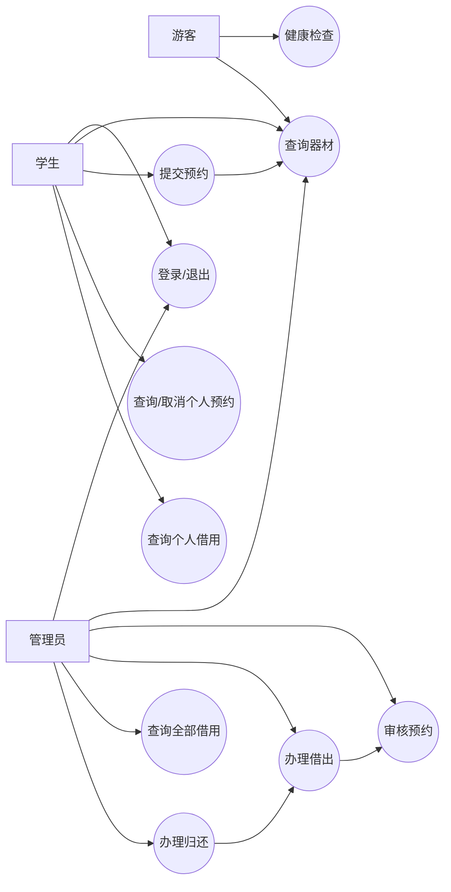

# T2 需求用例与质量属性场景分析

## 1. 分析目标

本文基于当前实现版 T1，对功能需求进行用例分析，对非功能需求使用质量属性场景方法进行分析，并给出可直接映射到 T6 的测试目标。

## 2. 参与者

| 参与者 | 类型 | 说明 |
| --- | --- | --- |
| 游客 | 外部参与者 | 未登录时可访问健康检查、器材分类和器材查询 |
| 学生用户 | 主要参与者 | 登录、查询器材、创建和取消预约、查询个人记录 |
| 管理员 | 主要参与者 | 登录、审核预约、办理借出和归还、查询全部记录 |
| MySQL | 支撑参与者 | 保存用户、器材、预约和借用数据并提供事务能力 |

## 3. 用例总览

| 编号 | 用例 | 参与者 | 对应需求 |
| --- | --- | --- | --- |
| UC-01 | 检查服务健康状态 | 游客 | FR-01 |
| UC-02 | 用户登录与退出 | 学生、管理员 | FR-02 |
| UC-03 | 查询当前用户 | 学生、管理员 | FR-02、FR-03 |
| UC-04 | 查询器材分类和器材 | 游客、学生、管理员 | FR-04、FR-05 |
| UC-05 | 提交预约 | 学生 | FR-06 |
| UC-06 | 查询个人预约 | 学生 | FR-07 |
| UC-07 | 取消预约 | 学生 | FR-08 |
| UC-08 | 审核预约 | 管理员 | FR-09 |
| UC-09 | 办理借出 | 管理员 | FR-10 |
| UC-10 | 查询借用记录 | 学生、管理员 | FR-11 |
| UC-11 | 办理归还 | 管理员 | FR-12 |
| UC-12 | 使用前端完成业务流程 | 学生、管理员 | FR-13 |

## 4. 用例关系

## 5. 核心用例

### UC-02 用户登录与退出

| 项目 | 内容 |
| --- | --- |
| 前置条件 | 用户账号存在且状态为 `ACTIVE` |
| 基本流程 | 1. 输入账号密码；2. 后端校验 SHA-256 摘要；3. 返回 Token 和用户信息；4. 前端按角色跳转；5. 退出时撤销 Token |
| 异常流程 | 参数为空返回 400；密码错误返回 401；账号停用返回 403；完全缺少必填 Authorization Header 时框架返回 400；重复使用已撤销 Token 返回 401 |
| 后置条件 | 登录成功时建立内存会话，退出后会话失效 |

### UC-04 查询器材

| 项目 | 内容 |
| --- | --- |
| 前置条件 | 后端和数据库可访问 |
| 基本流程 | 1. 查询分类；2. 使用分页参数查询器材；3. 可按分类筛选；4. 查询单个器材详情 |
| 异常流程 | 分页参数非法返回 400；器材不存在返回 404 |
| 后置条件 | 不修改业务数据 |

### UC-05 提交预约

| 项目 | 内容 |
| --- | --- |
| 前置条件 | 学生已登录；目标器材存在 |
| 基本流程 | 1. 提交器材、时间段、数量和备注；2. 校验角色、参数、器材状态和数量；3. 写入 `PENDING` 预约；4. 返回新预约 |
| 异常流程 | 未登录返回 401；角色错误返回 403；时间格式错误返回 400；库存或时段容量不足返回 409 |
| 后置条件 | 数据库新增一条待审核预约 |

### UC-07 取消预约

| 项目 | 内容 |
| --- | --- |
| 前置条件 | 学生已登录且预约属于当前用户 |
| 基本流程 | 1. 选择自己的 `PENDING/APPROVED` 预约；2. 填写原因；3. 状态改为 `CANCELED` |
| 异常流程 | 预约不存在返回 404；状态不允许取消返回 409 |
| 后置条件 | 预约不再进入借出流程 |

### UC-08 审核预约

| 项目 | 内容 |
| --- | --- |
| 前置条件 | 管理员已登录；预约状态为 `PENDING` |
| 基本流程 | 1. 查看预约；2. 选择通过或拒绝；3. 记录审核人、意见和时间；4. 更新状态 |
| 异常流程 | 学生访问返回 403；重复审核或状态已变化返回 409 |
| 后置条件 | 状态变为 `APPROVED` 或 `REJECTED` |

### UC-09 办理借出

| 项目 | 内容 |
| --- | --- |
| 前置条件 | 管理员已登录；预约状态为 `APPROVED`；库存充足 |
| 基本流程 | 1. 提交预约、借出时间和应还时间；2. 开启事务；3. 创建借用记录；4. 预约改为 `BORROWED`；5. 扣减库存；6. 提交事务 |
| 异常流程 | 预约未通过返回 409；库存变化或状态冲突时回滚 |
| 后置条件 | 产生 `BORROWING` 借用记录，库存按借用数量减少 |

### UC-11 办理归还

| 项目 | 内容 |
| --- | --- |
| 前置条件 | 管理员已登录；借用记录状态为 `BORROWING` |
| 基本流程 | 1. 提交归还时间和备注；2. 开启事务；3. 借用状态改为 `RETURNED`；4. 预约改为 `COMPLETED`；5. 恢复库存；6. 提交事务 |
| 异常流程 | 重复归还或状态已变化返回 409；任一步骤失败时回滚 |
| 后置条件 | 借用流程闭环，库存恢复 |

## 6. 用例到接口映射

| 用例 | 主要接口 |
| --- | --- |
| UC-01 | `GET /health` |
| UC-02 | `POST /api/login`、`POST /api/logout` |
| UC-03 | `GET /api/me` |
| UC-04 | `GET /api/equipment-categories`、`GET /api/equipment`、`GET /api/equipment/{id}` |
| UC-05 | `POST /api/reservations` |
| UC-06 | `GET /api/reservations/my`、`GET /api/reservations/my/{id}` |
| UC-07 | `POST /api/reservations/my/{id}/cancel` |
| UC-08 | `GET /api/admin/reservations`、`POST /api/admin/reservations/{id}/approve|reject` |
| UC-09 | `POST /api/admin/borrows` |
| UC-10 | `GET /api/borrows/my`、`GET /api/admin/borrows` 及详情接口 |
| UC-11 | `POST /api/admin/borrows/{id}/return` |

## 7. 质量属性场景

质量属性场景使用“刺激源、刺激、环境、制品、响应、响应度量”描述。

| 编号 | 属性 | 刺激源与刺激 | 环境 | 制品 | 响应 | 度量 |
| --- | --- | --- | --- | --- | --- | --- |
| QA-01 | 性能 | 200 个用户在短时间内查询器材 | 本地正常运行 | 器材查询接口、MySQL | 返回分页器材数据 | 成功率 100%，平均 <= 2 秒，P95 <= 3 秒 |
| QA-02 | 一致性 | 多个管理员请求并发办理同一预约 | 正常运行、存在竞争 | BorrowRecordService、DAO、InnoDB | 最多一个请求成功，库存只扣减一次 | 一条借用记录；库存不为负；归还后恢复 |
| QA-03 | 安全性 | 未登录用户访问受保护接口 | 网络可达 | Oat++ 参数绑定、Controller、UserService | 拒绝请求 | 缺少必填 Header 返回 400；无效 Token 返回 401 |
| QA-04 | 安全性 | 学生访问管理员接口或管理员创建学生预约 | 已登录 | Controller 角色检查 | 拒绝越权请求 | 返回 403 |
| QA-05 | 可恢复性 | 后端进程停止后重新启动 | MySQL 正常 | 后端进程、内存会话、数据库 | 服务恢复；业务数据保留；旧 Token 失效 | 5 分钟内恢复，重新登录后可继续查询 |
| QA-06 | 可维护性 | 修改预约业务规则 | 开发阶段 | Controller、Service、DAO | 主要修改集中在 Service，接口与 SQL 职责不混杂 | 分层依赖保持 `Controller -> Service -> DAO` |
| QA-07 | 可部署性 | 在目标 Windows 环境重新构建 | 依赖已安装 | CMake 工程 | 生成可执行程序并启动健康检查 | 构建成功，`/health` 返回 200 |
| QA-08 | 兼容性 | 用户使用现代桌面浏览器访问 | 前后端均运行 | HTML/CSS/JavaScript 前端 | 页面可加载并调用 JSON API | Edge/Chrome 可完成主链路 |

## 8. 质量属性优先级

| 优先级 | 属性 | 原因 |
| --- | --- | --- |
| 高 | 数据一致性 | 借出、归还与库存是系统核心正确性 |
| 高 | 安全性 | 学生和管理员权限必须隔离 |
| 高 | 性能 | 器材查询是高频入口 |
| 中 | 可恢复性 | 单体服务应能快速重启并保留持久化数据 |
| 中 | 可维护性 | 课程项目需要展示架构决策如何落地 |
| 中 | 可部署性 | 答辩现场需要稳定构建和启动 |
| 中 | 易用性与兼容性 | 页面需要支持现场演示 |

## 9. T6 测试映射

| 质量场景 | T6 测试方式 |
| --- | --- |
| QA-01 | Python 并发请求脚本统计平均值、P95、最大值和成功率 |
| QA-02 | 对同一已通过预约并发办理借出，并查询前后库存 |
| QA-03、QA-04 | API 自动化测试验证 401/403 |
| QA-05 | 测试运行器启动后端并测量健康检查恢复时间 |
| QA-06 | 静态检查目录和依赖方向，结合源代码评审 |
| QA-07 | CMake 重新构建并访问健康检查 |
| QA-08 | Edge/Chrome 人工页面检查 |

## 10. T2 结论

当前实现的核心用例是“查询器材、学生预约、管理员审核、借出和归还”。T6 测试应优先证明三件事：

1. 主业务链路和异常状态流转正确。
2. 权限隔离有效。
3. 并发操作下借用记录和库存保持一致。
