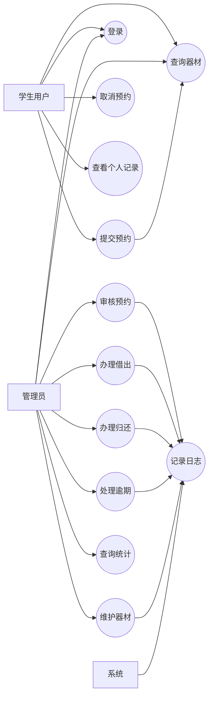

# T2 需求用例与质量属性场景分析

## 1. 分析目标

根据课程要求，T2 需要同时完成两部分工作：

1. 对 T1 中的功能性需求进行需求用例分析。
2. 对 T1 中的非功能性需求运用质量属性场景技术进行分析。

本文件即围绕这两个目标展开。

## 2. 参与者分析

| 参与者 | 类型 | 说明 |
| --- | --- | --- |
| 学生用户 | 主要参与者 | 发起查询、预约、取消预约、查看个人记录 |
| 管理员 | 主要参与者 | 维护器材、审核预约、办理借出归还、处理逾期、查看统计 |
| 系统 | 支撑参与者 | 负责库存校验、状态流转、日志记录、数据持久化 |

## 3. 用例总览

| 用例编号 | 用例名称 | 主要参与者 | 对应需求 |
| --- | --- | --- | --- |
| UC-01 | 用户登录 | 学生、管理员 | FR-01 |
| UC-02 | 查询器材信息 | 学生、管理员 | FR-02 |
| UC-03 | 提交预约申请 | 学生 | FR-03 |
| UC-04 | 取消预约申请 | 学生 | FR-03 |
| UC-05 | 查看个人预约与借还记录 | 学生 | FR-03、FR-09 |
| UC-06 | 审核预约 | 管理员 | FR-04 |
| UC-07 | 办理借出 | 管理员 | FR-05 |
| UC-08 | 办理归还 | 管理员 | FR-06 |
| UC-09 | 处理逾期记录 | 管理员 | FR-07 |
| UC-10 | 维护器材信息 | 管理员 | FR-08 |
| UC-11 | 查询统计报表 | 管理员 | FR-09 |
| UC-12 | 记录操作日志（后续扩展） | 系统 | FR-10 |

## 4. 用例关系图

## 5. 核心用例详细分析

### UC-02 查询器材信息

| 项目 | 内容 |
| --- | --- |
| 用例名称 | 查询器材信息 |
| 主要参与者 | 学生用户、管理员 |
| 前置条件 | 用户已登录系统 |
| 触发条件 | 用户进入器材列表页面或主动发起查询 |
| 基本流程 | 1. 用户输入筛选条件；2. 系统返回器材列表；3. 用户查看库存、状态和可借信息 |
| 备选流程 | 若无匹配结果，系统返回空列表并提示未找到相关器材 |
| 后置条件 | 无数据变更，仅完成信息展示 |

### UC-03 提交预约申请

| 项目 | 内容 |
| --- | --- |
| 用例名称 | 提交预约申请 |
| 主要参与者 | 学生用户 |
| 前置条件 | 学生已登录；所选器材处于可用状态；预约时间合法 |
| 触发条件 | 学生点击“预约”按钮并提交申请 |
| 基本流程 | 1. 学生选择器材、时间段和数量；2. 系统校验库存与状态；3. 系统生成预约记录并置为“待审核”；4. 系统提示提交成功 |
| 备选流程 | 库存不足、器材停用、时间冲突或参数不合法时，系统拒绝创建预约并提示原因 |
| 后置条件 | 形成一条待审核预约记录 |

### UC-06 审核预约

| 项目 | 内容 |
| --- | --- |
| 用例名称 | 审核预约 |
| 主要参与者 | 管理员 |
| 前置条件 | 管理员已登录；存在待审核预约 |
| 触发条件 | 管理员进入审核页面并选择某条预约 |
| 基本流程 | 1. 管理员查看预约详情；2. 系统展示器材库存与预约时间；3. 管理员选择通过或拒绝；4. 系统更新预约状态并记录审核意见 |
| 备选流程 | 若预约已被取消或状态已变更，系统拒绝重复审核并提示当前状态 |
| 后置条件 | 预约状态变为“审核通过”或“审核拒绝” |

### UC-07 办理借出

| 项目 | 内容 |
| --- | --- |
| 用例名称 | 办理借出 |
| 主要参与者 | 管理员 |
| 前置条件 | 预约已审核通过；器材可用库存充足 |
| 触发条件 | 管理员在预约记录中点击“办理借出” |
| 基本流程 | 1. 系统再次校验库存；2. 管理员确认借出；3. 系统生成借用记录；4. 系统扣减可用库存；5. 系统更新预约状态为“已借出”；6. 系统记录日志 |
| 备选流程 | 若办理时库存已变化导致不足，系统终止借出并提示重新处理 |
| 后置条件 | 形成有效借用记录，库存发生变化 |

### UC-08 办理归还

| 项目 | 内容 |
| --- | --- |
| 用例名称 | 办理归还 |
| 主要参与者 | 管理员 |
| 前置条件 | 存在未归还借用记录 |
| 触发条件 | 管理员确认学生归还器材 |
| 基本流程 | 1. 系统读取借用记录；2. 管理员确认归还数量与状态；3. 系统回收库存；4. 系统更新借用记录状态为“已归还”；5. 若已逾期则同步更新相关状态或备注；6. 系统记录日志 |
| 备选流程 | 若借用记录不存在或已归还，系统拒绝重复办理 |
| 后置条件 | 库存回收成功，借用记录闭环 |

### UC-10 维护器材信息

| 项目 | 内容 |
| --- | --- |
| 用例名称 | 维护器材信息 |
| 主要参与者 | 管理员 |
| 前置条件 | 管理员已登录 |
| 触发条件 | 管理员新增器材或修改现有器材 |
| 基本流程 | 1. 管理员填写器材基础信息；2. 系统校验名称、分类、库存等字段；3. 系统保存数据 |
| 备选流程 | 若分类不存在、库存非法或存在重名冲突，系统拒绝提交并提示修正 |
| 后置条件 | 器材主数据完成新增或更新 |

## 6. 功能需求到用例的映射

| 功能需求 | 关键用例 |
| --- | --- |
| FR-01 用户认证与角色识别 | UC-01 |
| FR-02 器材查询 | UC-02 |
| FR-03 预约管理 | UC-03、UC-04、UC-05 |
| FR-04 预约审核 | UC-06 |
| FR-05 借出管理 | UC-07 |
| FR-06 归还管理 | UC-08 |
| FR-07 逾期管理 | UC-09 |
| FR-08 器材管理 | UC-10 |
| FR-09 统计查询 | UC-05、UC-11 |
| FR-10 操作日志（后续扩展） | UC-12 |

## 7. 质量属性场景分析方法

质量属性场景通常从六个要素描述：

- 刺激源
- 刺激
- 环境
- 制品
- 响应
- 响应度量

下面结合 T1 中的非功能性需求，构造本系统的关键质量属性场景。

## 8. 质量属性场景

| 场景编号 | 质量属性 | 刺激源/刺激 | 环境 | 制品 | 期望响应 | 响应度量 |
| --- | --- | --- | --- | --- | --- | --- |
| QA-01 | 性能 | 大量学生在课前集中查询器材 | 正常运行、高峰时段 | 器材查询接口、数据库查询 | 系统快速返回器材列表与库存信息 | 平均响应时间 <= 2 秒，95% 请求 <= 3 秒 |
| QA-02 | 数据一致性 | 多名学生同时预约同一器材 | 正常运行、存在并发请求 | 预约服务、库存表、借用记录 | 系统确保库存扣减正确，不出现超借 | 可用库存不为负；同一时段预约总量不超过可用库存 |
| QA-03 | 可用性 | 应用进程异常退出 | 运行中发生故障 | 后端服务、数据库连接 | 系统可恢复运行，关键数据不丢失 | 5 分钟内恢复；已提交事务不丢失 |
| QA-04 | 安全性 | 未授权用户尝试访问管理员接口 | 网络可达但未授权 | 登录模块、鉴权模块、管理接口 | 系统拒绝访问并记录失败信息 | 非法请求 100% 被拒绝；关键失败事件可追踪 |
| QA-05 | 可维护性 | 后续新增“排球网”器材类型或新增一类统计报表 | 需求变更阶段 | 分层架构、接口层、服务层、DAO 层 | 局部修改即可完成需求扩展 | 主要修改集中在 3 个以内模块，不破坏核心流程 |
| QA-06 | 可扩展性 | 后续需要增加“教师用户”角色 | 迭代升级阶段 | 用户、权限、接口控制模块 | 系统在现有角色模型上扩展新角色 | 不需要推翻整体架构，仅增加角色与权限映射 |
| QA-07 | 易用性 | 新用户首次使用系统进行预约 | 正常运行 | 前端页面、表单交互、提示信息 | 用户能在短时间内完成预约 | 3 分钟内可独立完成一次预约 |
| QA-08 | 可审计性（后续扩展） | 管理员调整库存或审核预约后发生争议 | 事后追溯阶段 | 操作日志模块（待后续添加） | 后续版本应能追溯操作人、时间、对象和结果 | 本版本先保留扩展位，后续版本再补齐完整日志能力 |

## 9. 质量属性优先级分析

结合该系统的业务特征，优先级排序如下：

| 优先级 | 质量属性 | 原因 |
| --- | --- | --- |
| 高 | 数据一致性 | 器材库存、预约和借出状态必须准确，否则系统核心价值失效 |
| 高 | 安全性 | 系统涉及角色权限与管理操作，越权访问不可接受 |
| 高 | 性能 | 预约和查询通常发生在课前集中时段，性能体验影响使用效果 |
| 中 | 可维护性 | 课程项目需要逐步演进到实现与测试阶段，结构必须清晰 |
| 中 | 可用性 | 实验环境下无需高可用集群，但应具备基本恢复能力 |
| 中 | 可审计性 | 管理场景存在责任追溯需求，日志设计不可缺失 |
| 中 | 易用性 | 页面需要简单直接，降低学生和管理员使用成本 |
| 中 | 可扩展性 | 当前规模适中，但后续 T5 及系统升级会受益于扩展性 |

## 10. T2 输出结论

T2 的分析结果表明：

1. 本系统的核心业务链路是“查询 -> 预约 -> 审核 -> 借出 -> 归还”。
2. 核心架构关注点集中在库存一致性、权限控制、接口性能、后续维护，以及预留的日志审计扩展能力。
3. 后续 T3 架构设计应重点围绕高优先级质量属性进行设计决策，尤其要解决并发预约下的库存一致性问题。
