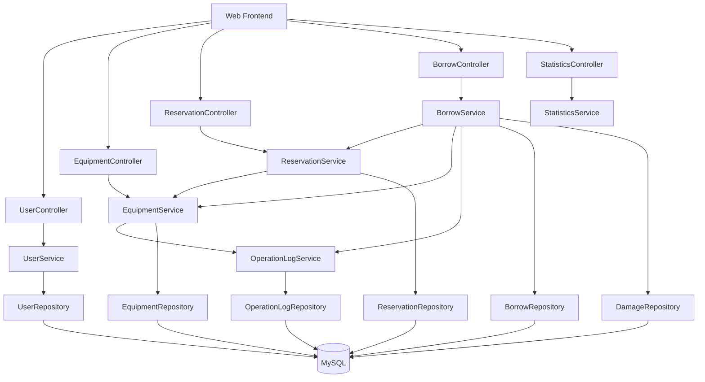
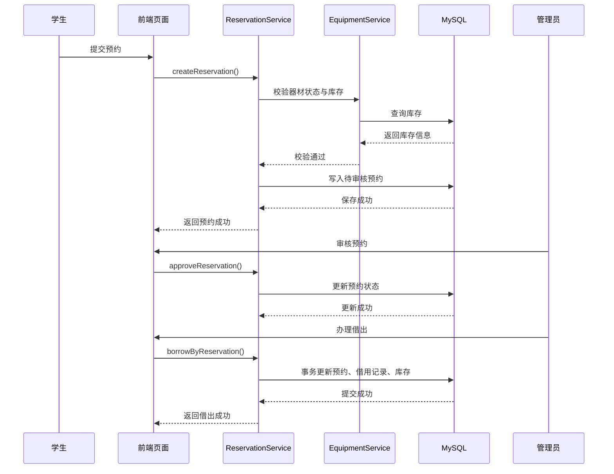

# T3 架构设计决策

## 1. 设计目标

基于 T2 的需求分析结果，本系统的架构设计需要同时满足以下目标：

1. 支撑完整的器材预约与借还业务流程。
2. 优先保证库存、预约与借用状态的一致性。
3. 清晰隔离接口层、业务层和数据访问层，便于后续实现与维护。
4. 在课程项目规模内保持实现复杂度可控，适合 C++ 技术栈落地。

## 2. 关键架构驱动因素

| 类型 | 内容 |
| --- | --- |
| 业务驱动 | 学生预约与管理员审核、借出、归还构成完整闭环 |
| 质量驱动 | 数据一致性、安全性、性能、可维护性为高优先级关注点 |
| 技术驱动 | 后端采用 C++17，适合用 Oat++ 提供 RESTful API，MySQL 保存结构化业务数据 |
| 约束条件 | 课程项目时间有限，要求中等规模、结构清晰、便于演示与答辩 |

## 3. 总体架构风格选择

本系统采用以下架构风格与模式的组合：

| 决策编号 | 设计决策 | 采用的风格/模式 | 主要动机 |
| --- | --- | --- | --- |
| AD-01 | 采用浏览器/服务器架构 | B/S、客户端-服务器风格 | 降低客户端部署成本，便于课程演示 |
| AD-02 | 后端采用 RESTful Web 服务 | 资源导向接口风格 | 方便前后端分离、接口调试和后续扩展 |
| AD-03 | 后端采用分层架构 | Controller-Service-Repository-Database | 提高可维护性与可测试性 |
| AD-04 | 业务流程采用状态驱动 | 状态机思想 | 明确预约、借出、归还、异常的状态流转 |
| AD-05 | 数据访问采用仓储/DAO 模式 | Repository/DAO 模式 | 屏蔽数据库细节，便于替换和测试 |
| AD-06 | 权限控制采用基于角色的访问控制 | RBAC | 满足学生与管理员的权限隔离要求 |
| AD-07 | 关键操作统一留痕 | 审计日志模式 | 满足可审计性要求 |

## 4. 分层架构设计

### 4.1 分层说明

```text
前端展示层
  HTML + CSS + JavaScript + Bootstrap
        |
接口层
  Oat++ Controller / DTO / Auth Filter
        |
业务层
  UserService / EquipmentService / ReservationService / BorrowService / StatisticsService
        |
数据访问层
  UserRepository / EquipmentRepository / ReservationRepository / BorrowRepository / LogRepository
        |
数据存储层
  MySQL 8.0
```

### 4.2 各层职责

| 层次 | 职责 |
| --- | --- |
| 展示层 | 页面展示、表单输入、调用后端接口、展示结果 |
| 接口层 | 路由分发、参数校验、DTO 转换、统一返回格式、鉴权入口 |
| 业务层 | 执行业务规则、库存校验、状态流转、事务组织 |
| 数据访问层 | 封装 SQL/持久化操作，隔离数据库细节 |
| 数据层 | 保存用户、器材、预约、借还、异常与日志数据 |

## 5. 组件划分



## 6. 核心设计决策说明

### AD-01 采用前后端分离的 B/S 架构

前端使用 HTML + CSS + JavaScript + Bootstrap，负责页面展示和调用接口；后端以 Oat++ 暴露 REST API。这样做有三点好处：

- 学生和管理员仅需浏览器即可使用系统。
- 前后端职责边界清晰，便于分工和调试。
- 接口可通过 Swagger/OpenAPI 直接演示，适合课程答辩。

### AD-02 采用 RESTful API 作为对外服务形式

接口以资源为核心组织，例如：

- `/api/users/login`
- `/api/equipment`
- `/api/reservations`
- `/api/borrows`
- `/api/statistics`

这一决策有助于：

- 统一接口风格
- 简化前端调用逻辑
- 降低模块耦合度
- 方便后续扩展移动端或其他客户端

### AD-03 后端采用分层架构

Controller 仅负责接收请求、参数转换与返回结果；Service 层负责业务规则；Repository/DAO 层负责数据库访问。

该决策主要服务于：

- 可维护性：功能变化时优先修改局部层次
- 可测试性：业务逻辑可以独立于接口测试
- 可复用性：多个接口可共享同一业务服务

### AD-04 预约与借还流程使用状态机思想

系统中至少包含以下关键状态：

| 对象 | 状态 |
| --- | --- |
| Reservation | 待审核、审核通过、审核拒绝、已取消、已借出、已完成 |
| BorrowRecord | 借出中、已归还、逾期、损坏待处理、已关闭 |
| Equipment | 可用、停用、维修中 |

状态机思想的价值在于：

- 避免非法状态跳转
- 使业务流程更容易推理
- 便于日志记录和异常处理

### AD-05 使用事务保证库存一致性

对于“审核通过后的借出办理”“归还并回收库存”“异常登记”等复合操作，后端需要在数据库事务中完成以下步骤：

1. 校验当前记录状态。
2. 锁定或读取器材库存。
3. 更新预约或借用状态。
4. 修改库存数量。
5. 写入日志或异常记录。

该决策直接支撑 T2 中最重要的质量属性之一：数据一致性。

### AD-06 使用 RBAC 实现权限控制

系统将用户角色至少划分为：

- 学生：仅允许查询、提交预约、取消预约、查看个人记录
- 管理员：允许维护器材、审核预约、办理借还、查看统计与日志

接口层在进入业务逻辑前执行角色校验，防止普通学生越权调用管理员接口。

### AD-07 使用审计日志记录关键管理操作

需要落日志的典型场景包括：

- 管理员登录
- 审核预约
- 办理借出
- 办理归还
- 登记损坏或逾期
- 修改库存
- 修改器材状态

日志字段建议至少包含：操作人、时间、操作类型、目标对象、摘要、结果。

### AD-08 采用关系型数据库存储核心业务数据

系统中的器材、库存、预约、借用、异常和日志天然具有关联关系和一致性要求，因此采用 MySQL 作为主存储更合适。

推荐数据表如下：

| 表名 | 作用 |
| --- | --- |
| `user` | 用户与角色信息 |
| `equipment_category` | 器材分类 |
| `equipment` | 器材基础信息、库存与状态 |
| `reservation` | 预约记录与审核状态 |
| `borrow_record` | 借出、归还与逾期状态 |
| `damage_record` | 损坏和异常登记 |
| `operation_log` | 管理操作审计日志 |

### AD-09 保持单体部署，控制课程项目复杂度

在课程实验环境中，系统优先采用单体部署：

- 一个 Oat++ 后端服务
- 一个 MySQL 数据库
- 一个静态前端目录

这一决策可以减少：

- 分布式部署和运维复杂度
- 多服务调用链排查成本
- 项目实现和答辩准备难度

同时，分层与模块化设计仍为后续服务拆分留下空间。

## 7. 关键业务流程设计

### 7.1 预约到借出的主流程



### 7.2 归还与异常处理流程

归还流程中，如果器材正常归还，则只回收库存并关闭借用记录；如果存在损坏或逾期，则在事务内同时写入异常记录，保证业务留痕完整。

## 8. 质量属性与架构决策映射

| 质量属性 | 关键设计决策 | 支撑方式 |
| --- | --- | --- |
| 数据一致性 | AD-03、AD-04、AD-05、AD-08 | 通过分层业务约束、状态流转和事务控制保证库存与记录一致 |
| 安全性 | AD-02、AD-06、AD-07 | 通过统一接口入口、RBAC 和日志审计防止越权与不可追踪行为 |
| 性能 | AD-02、AD-03、AD-08 | 简化调用链、合理组织接口、为热点查询建立索引 |
| 可维护性 | AD-03、AD-05、AD-08 | 职责分离、DAO 封装、稳定的数据模型便于修改 |
| 可用性 | AD-08、AD-09 | 单体部署结构简单，数据库持久化稳定，故障恢复路径清晰 |
| 可审计性 | AD-07 | 将关键管理行为纳入统一日志 |
| 可扩展性 | AD-01、AD-02、AD-03 | 前后端解耦、接口标准化、模块边界清楚 |

## 9. 技术选型落地建议

| 领域 | 选型 | 说明 |
| --- | --- | --- |
| 后端语言 | C++17 | 满足课程与项目主题要求 |
| Web 框架 | Oat++ | 适合 C++ REST API 开发 |
| 构建工具 | CMake | 统一项目构建 |
| 数据库 | MySQL 8.0 | 事务和关系模型适合当前场景 |
| 数据访问 | MySQL Connector/C++ | 官方连接库，便于 C++ 集成 |
| 前端 | HTML + CSS + JS + Bootstrap 5 | 低门槛、适合课程展示 |
| 接口文档 | oatpp-swagger | 便于调试和演示 |

## 10. T3 结论

本架构设计选择了“前后端分离 + RESTful 接口 + 分层单体 + 事务一致性 + RBAC + 审计日志”的总体方案。该方案在课程项目范围内兼顾了实现可行性、业务完整性和架构分析价值，为 T4 的 ATAM 评估提供了明确的设计对象。
