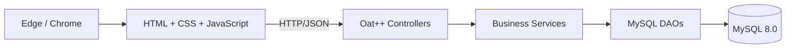

# T3 架构设计决策

## 1. 文档说明

本文描述当前 `version 1.0` 代码实际采用的架构，不包含尚未实现的统计服务、器材维护服务、自动逾期服务和操作日志服务。

## 2. 架构驱动因素

| 类型 | 驱动因素 |
| --- | --- |
| 业务 | 打通“查询 -> 预约 -> 审核 -> 借出 -> 归还” |
| 一致性 | 借出和归还涉及预约、借用记录和库存的原子更新 |
| 安全 | 学生和管理员接口需要角色隔离 |
| 性能 | 器材分页查询需要支撑课程演示环境下的集中访问 |
| 可维护性 | HTTP、业务规则和 SQL 应分层组织 |
| 约束 | 使用 C++17、Oat++、MySQL 和 Windows 本地开发环境 |

## 3. 总体架构

系统采用：

`静态多页面前端 + REST API + 分层单体后端 + MySQL`



选择单体架构的原因是当前系统规模适中，课程项目更重视结构清晰、可运行和可解释性，无需引入微服务通信和部署复杂度。

## 4. 关键架构决策

| 编号 | 决策 | 实现方式 | 主要质量属性 |
| --- | --- | --- | --- |
| AD-01 | 前后端分离 | 静态前端通过 `fetch` 调用 REST API | 可维护性、兼容性 |
| AD-02 | 分层单体 | Controller、Service、DAO、MySQL | 可维护性 |
| AD-03 | 面向资源的 HTTP 接口 | `/api/equipment`、`/api/reservations`、`/api/admin/borrows` 等 | 易用性、可扩展性 |
| AD-04 | DTO 与内部模型分离 | `dto/request`、`dto/response`、`model` | 可维护性 |
| AD-05 | 状态驱动业务流程 | Service 层显式检查预约和借用状态 | 正确性 |
| AD-06 | 数据库事务 | 借出和归还在 DAO 内使用 InnoDB 事务 | 数据一致性 |
| AD-07 | 基于角色的访问控制 | Bearer Token + Controller 角色检查 | 安全性 |
| AD-08 | 分页和索引 | 列表接口分页，核心表建立组合索引 | 性能 |
| AD-09 | Mock/Live 双数据源前端 | 页面统一通过 `api.js`，当前默认 `USE_MOCK=false` | 可测试性、可维护性 |
| AD-10 | 单体本地部署 | 一个后端进程、一个 MySQL、一个静态文件服务 | 可部署性 |

## 5. 代码分层

```text
frontend/
  pages/                 页面入口
  assets/js/api.js       统一后端接口适配
  assets/js/guard.js     前端登录与角色页面守卫
  assets/js/*-page.js    页面业务交互

backend/src/
  app/                   应用入口和 Oat++ 组件
  controller/            HTTP 路由、参数接收、鉴权和响应 DTO
  service/               参数规则、状态流转和业务组织
  dao/                   MySQL 连接、SQL 和事务
  dto/                   HTTP 请求/响应对象
  model/                 内部数据模型
```

后端的实际调用方向为：

```text
Controller -> Service -> DAO -> MySQL
```

Controller 不直接执行 SQL，Service 不构造 HTTP 响应，DAO 不负责页面或角色跳转。

## 6. 运行时组件

### 6.1 AppComponent

`AppComponent.hpp` 负责创建：

- `ServerConnectionProvider`：监听 `0.0.0.0:8000`
- `HttpRouter`：保存控制器路由
- `HttpConnectionHandler`：分发 HTTP 请求
- CORS 拦截器：允许前端跨端口访问
- JSON `ObjectMapper`：DTO 与 JSON 转换

### 6.2 Controller

| Controller | 主要职责 |
| --- | --- |
| HealthController | 健康检查 |
| AuthController | 登录、当前用户、退出 |
| EquipmentCategoryController | 分类查询 |
| EquipmentController | 器材分页和详情 |
| ReservationController | 学生预约、学生查询、管理员审核 |
| BorrowRecordController | 借出、归还、学生/管理员借用查询 |

### 6.3 Service

| Service | 核心规则 |
| --- | --- |
| UserService | 登录认证、Token 生成、内存会话管理 |
| EquipmentCategoryService | 查询启用分类 |
| EquipmentService | 分页参数和器材查询 |
| ReservationService | 时间、数量、库存、重叠预约和状态检查 |
| BorrowRecordService | 借出/归还时间与状态检查，调用事务 DAO |

### 6.4 DAO

DAO 使用 MariaDB/MySQL C Client，每次业务调用创建数据库连接。主要 DAO：

- `UserDAO`
- `EquipmentCategoryDAO`
- `EquipmentDAO`
- `ReservationDAO`
- `BorrowRecordDAO`

当前 SQL 使用 `mysql_real_escape_string` 处理字符串输入，数值参数在转换后拼接。

## 7. 数据架构

### 7.1 核心表

| 表 | 作用 |
| --- | --- |
| `user` | 用户、角色、账号状态 |
| `equipment_category` | 器材分类 |
| `equipment` | 器材与库存 |
| `reservation` | 预约和审核结果 |
| `borrow_record` | 借出与归还记录 |

`operation_log` 表只作为数据库预留结构，当前没有对应 Controller、Service 或 DAO，不属于运行时组件。

### 7.2 数据约束

- 用户名、学号和邮箱唯一。
- 器材编号唯一。
- 预约编号唯一。
- 一个预约最多对应一条借用记录。
- `available_stock <= total_stock`。
- 预约和借用数量必须大于 0。
- 数据库使用外键维护主要引用关系。

## 8. 状态机设计

### 8.1 预约状态

| 当前状态 | 允许操作 | 目标状态 |
| --- | --- | --- |
| PENDING | 管理员通过 | APPROVED |
| PENDING | 管理员拒绝 | REJECTED |
| PENDING | 学生取消 | CANCELED |
| APPROVED | 学生取消 | CANCELED |
| APPROVED | 管理员借出 | BORROWED |
| BORROWED | 管理员归还 | COMPLETED |

Service 层在更新前检查当前状态，DAO 更新语句再次使用 `WHERE status=...`，降低重复操作和并发状态变化的风险。

### 8.2 借用状态

当前业务流程使用：

| 当前状态 | 允许操作 | 目标状态 |
| --- | --- | --- |
| BORROWING | 管理员归还 | RETURNED |

`OVERDUE` 和 `CLOSED` 暂未进入当前实现流程。

## 9. 一致性设计

### 9.1 借出事务

`BorrowRecordDAO::createFromApprovedReservation` 在一个事务中：

1. 使用 `FOR UPDATE` 锁定预约及关联库存行并读取状态。
2. 校验预约为 `APPROVED` 且库存充足。
3. 插入借用记录。
4. 将预约更新为 `BORROWED`。
5. 使用 `available_stock >= quantity` 条件扣减库存。
6. 全部成功后提交，否则回滚。

数据库对 `borrow_record.reservation_id` 的唯一约束防止同一预约生成多条借用记录。

### 9.2 归还事务

`BorrowRecordDAO::returnBorrowRecord` 在一个事务中：

1. 使用 `FOR UPDATE` 锁定借用记录并读取状态。
2. 校验状态为 `BORROWING`。
3. 更新借用记录为 `RETURNED`。
4. 将预约更新为 `COMPLETED`。
5. 恢复器材可用库存。
6. 全部成功后提交，否则回滚。

### 9.3 已知边界

预约创建阶段的“查询重叠数量”和“插入预约”当前不在同一事务中。T6 应重点测试借出事务一致性，同时将高并发预约作为已知风险记录，不虚构当前实现已完全解决该问题。

## 10. 安全设计

### 10.1 认证

- 登录时数据库使用 `SHA2(password, 256)` 比对密码摘要。
- 登录成功生成 128 位十六进制随机 Token。
- Token 到用户 ID 的映射保存在 `UserService` 内存。
- 退出登录删除 Token。

### 10.2 授权

ReservationController 和 BorrowRecordController 在进入业务逻辑前执行：

1. Bearer Token 格式检查。
2. Token 有效性检查。
3. 用户 `ACTIVE` 状态检查。
4. `STUDENT` 或 `ADMIN` 角色检查。

当前鉴权帮助函数存在于两个 Controller 中，能够满足本版本权限控制，但后续接口增加时可重构为统一中间件。

### 10.3 安全边界

当前方案适用于本地课程演示，不等同于生产级认证：

- 密码摘要没有独立盐值。
- Token 没有过期时间和持久化。
- CORS 当前允许任意来源。
- 数据库配置保存在本地配置文件。

## 11. 前端架构

前端采用静态多页面结构，不依赖 Node.js：

- `auth.js` 管理本地登录态。
- `guard.js` 检查页面角色。
- `api.js` 统一封装请求、Token、401 处理和错误解析。
- `shell.js` 生成公共导航和页面框架。
- `mock-api.js` 保留离线开发能力。
- 当前 `config.js` 设置 `USE_MOCK=false`，默认访问真实后端。

页面包括登录、学生器材、学生预约、学生借用、管理员预约和管理员借还。

## 12. 部署架构

```text
浏览器
  |-- http://127.0.0.1:5500  Python 静态文件服务
  |
  +-- http://127.0.0.1:8000  Oat++ 后端
                                  |
                                  +-- 127.0.0.1:3306 MySQL
```

仓库提供：

- `scripts/build-backend.cmd`
- `scripts/run-backend.cmd`
- `scripts/run-frontend.cmd`
- `scripts/start-project.ps1`

## 13. 质量属性映射

| 质量属性 | 架构决策 |
| --- | --- |
| 数据一致性 | 状态机、条件更新、唯一约束、借出/归还事务 |
| 安全性 | Bearer Token、用户状态检查、角色检查 |
| 性能 | 分页查询、数据库索引、单体调用链 |
| 可维护性 | 前后端分离、Controller-Service-DAO、DTO/Model 分离 |
| 可恢复性 | 无状态 HTTP 服务 + MySQL 持久化；重启后重新登录 |
| 可部署性 | CMake、单进程后端、静态前端和启动脚本 |

## 14. T3 结论

当前系统的实际架构是一个围绕核心预约借还流程设计的分层单体。它没有覆盖所有管理系统设想，而是通过状态检查、数据库约束和事务，把已经实现的主链路做成可运行、可测试、可解释的课程项目。T6 将验证这些决策是否真实支撑功能、权限、性能和一致性目标。
